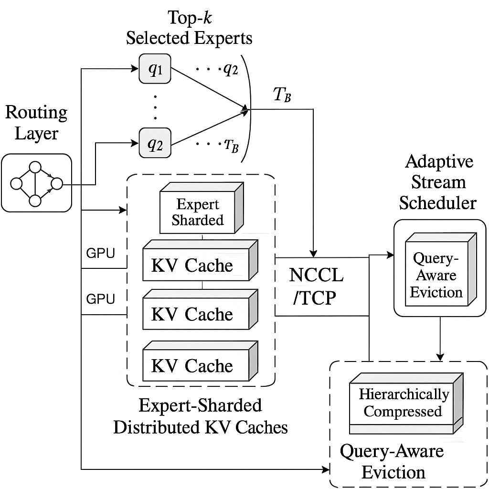
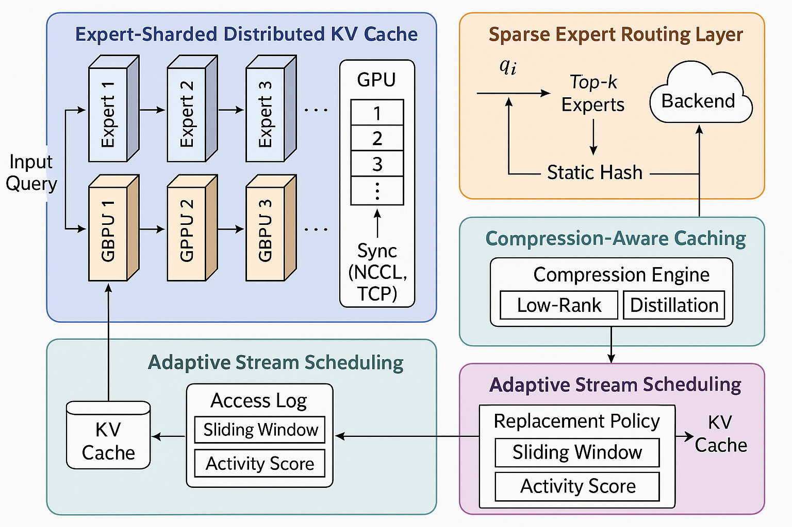
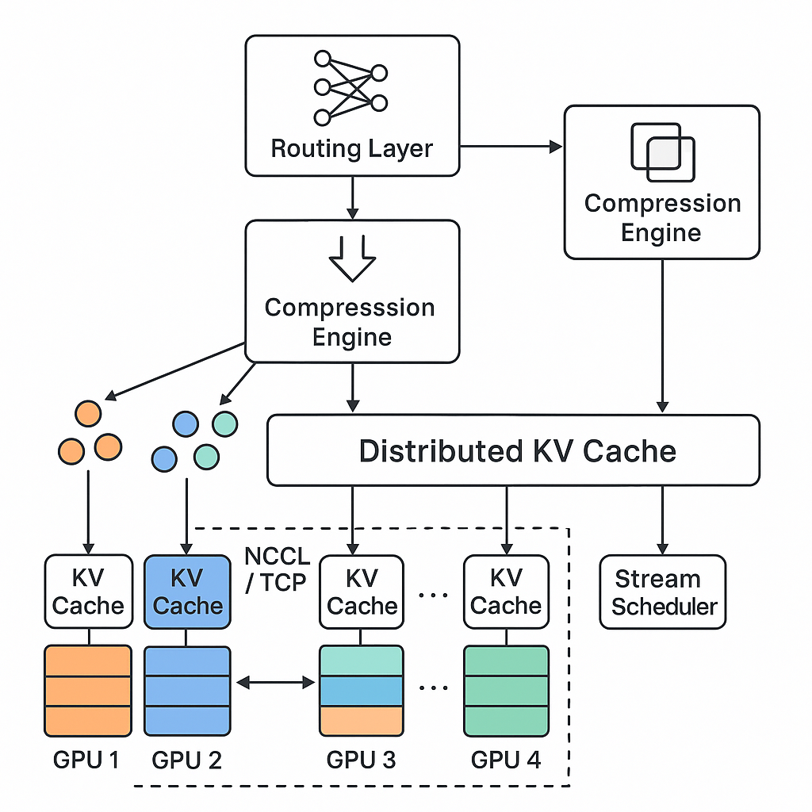
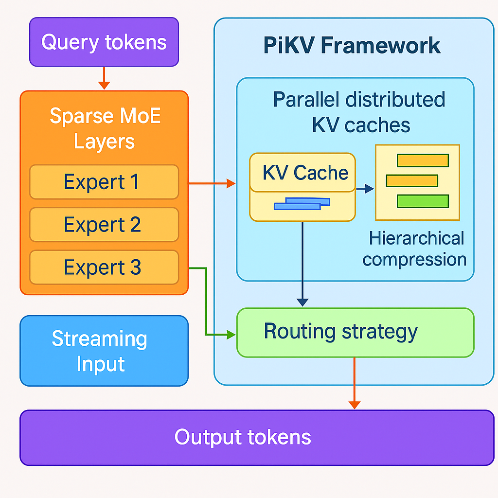
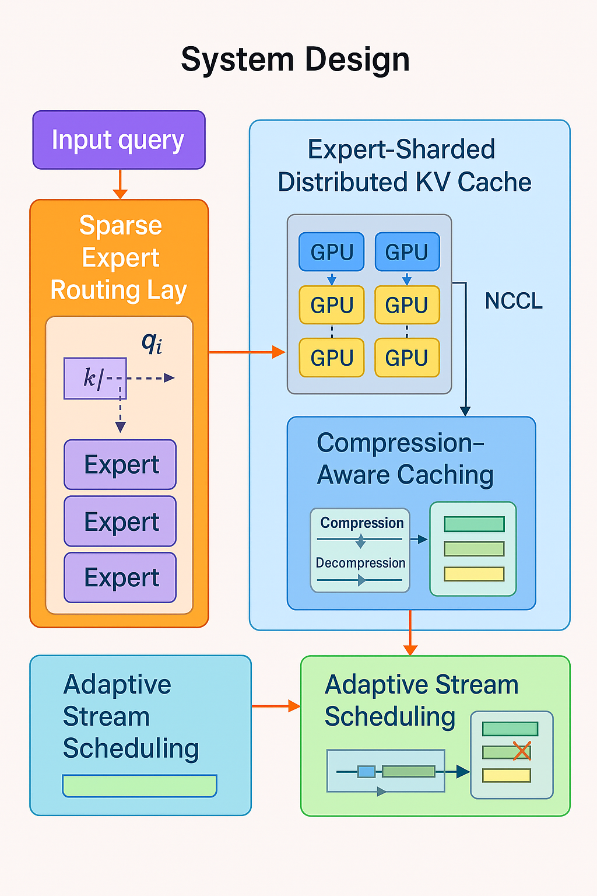

<div align="center">

# 🚀 PiKV: Parallel Distributed Key-Value Cache Design with Routing

*Revolutionary KV Cache System with Intelligent Routing and Advanced Compression for Large Language Models*

[](https://www.python.org/downloads/)
[](https://pytorch.org/)
[](https://opensource.org/licenses/Apache-2.0)
[](https://github.com/psf/black)
[](http://makeapullrequest.com)

[📚 Features](#-key-features) • [🚀 Installation](#-installation) • [💡 Examples](#-usage-examples) • [🔧 Advanced](#-advanced-features) • [📊 Benchmarks](#-benchmarks)

</div>

---

## 📋 Table of Contents

- [🔥 Overview](#-overview)
- [🎯 Key Features](#-key-features)  
- [🏗️ System Architecture](#️-system-architecture)
- [📦 Installation](#-installation)
- [🚀 Quick Start](#-quick-start)
- [💡 Usage Examples](#-usage-examples)
- [🔧 Advanced Features](#-advanced-features)
- [📊 Benchmarks](#-benchmarks)
- [🛠️ Development](#️-development)
- [🤝 Contributing](#-contributing)
- [📝 Citation](#-citation)

## 🔥 Overview

PiKV is a cutting-edge **Parallel Distributed Key-Value Cache Design** that revolutionizes how large language models handle memory and attention mechanisms. Through innovative routing strategies, advanced compression techniques, and intelligent cache scheduling, PiKV achieves significant performance improvements while maintaining model quality.

<div align="center">

<p><em>Figure 1: PiKV System Architecture - Complete Overview</em></p>
</div>

### 🌟 Why PiKV?

- **🚀 Performance**: Up to 2.2x faster inference with 65% memory reduction
- **🧠 Intelligence**: Advanced routing with importance-aware token distribution  
- **🗜️ Efficiency**: Multi-strategy compression (Pyramid, SVD, Quantization)
- **⚡ Flexibility**: Dynamic cache scheduling with 7+ policies
- **🎓 Learning**: State-of-the-art knowledge distillation techniques

## 🎯 Key Features

### 🔮 Core Components

| Component | Description | Methods Available |
|-----------|-------------|------------------|
| **🧠 Smart Routing** | Advanced routing strategies for optimal expert selection | TopK, Adaptive, EPLB, Hierarchical |
| **🗜️ Compression Engine** | Multi-strategy compression for memory efficiency | Pyramid, SVD, Quantization, Hybrid |
| **⚡ Cache Scheduling** | Dynamic cache management policies | LRU, H2O, StreamingLLM, QUEST, FlexGen |
| **🎓 Knowledge Distillation** | Advanced distillation techniques | DistillM, DistillM-2, Speculative KD |
| **🔧 LoRA Integration** | Low-rank adaptation for efficient fine-tuning | Fully integrated with caching |
| **🚀 CUDA Acceleration** | Custom kernels for maximum performance | Optimized routing and compression |

### 📈 Performance Metrics

```
Memory Usage Reduction    │ Inference Speed Improvement
                         │
Standard MoE             │ Standard MoE        
████████████ 100%        │ ██████ 1.0x        
                         │                    
PiKV (No Compress)       │ PiKV (No Compress) 
██████████ 85%           │ ████████ 1.3x      
                         │                    
PiKV (Pyramid)           │ PiKV (Pyramid)     
██████ 52%               │ ██████████ 1.8x    
                         │                    
PiKV (Quantized)         │ PiKV (Quantized)   
████ 35%                 │ ████████████ 2.2x  
```

## 🏗️ System Architecture

### 📊 Algorithm Flow

<div align="center">

<p><em>Figure 2: PiKV Algorithm Flow - From Input to Output</em></p>
</div>

### 🔄 Routing Strategies

PiKV employs sophisticated routing mechanisms to intelligently distribute tokens across experts:

<div align="center">

<p><em>Figure 3: Advanced Routing Strategies - TopK, Adaptive, EPLB, and Hierarchical</em></p>
</div>

### 🏛️ MoE Architecture Integration

The Mixture-of-Experts architecture enhanced with KV cache optimization:

<div align="center">

<p><em>Figure 4: PiKV MoE with Integrated Cache System</em></p>
</div>

### 🎯 Complete Architecture

<div align="center">

<p><em>Figure 5: Complete PiKV Architecture - All Components</em></p>
</div>

## 📦 Installation

### 🔧 Prerequisites

- **Python**: 3.8 or higher
- **PyTorch**: 2.0 or higher  
- **CUDA**: 11.8+ (for GPU acceleration)
- **Memory**: 8GB+ RAM (16GB+ recommended for large models)

### ⚡ Quick Installation

```bash
# Clone the repository
git clone https://github.com/your-org/PiKV.git
cd PiKV

# Install dependencies
pip install -r requirements.txt

# Install PiKV in development mode
pip install -e .
```

### 🐳 CUDA Extensions (Optional)

For maximum performance, install custom CUDA kernels:

```bash
# Make installation script executable
chmod +x install_pikv.sh

# Install CUDA extensions
./install_pikv.sh
```

### 📋 Key Dependencies

```txt
torch>=2.0.0
transformers>=4.21.0
accelerate>=0.20.0
datasets>=2.0.0
numpy>=1.21.0
matplotlib>=3.5.0
tqdm>=4.64.0
cupy-cuda11x>=12.0.0  # For CUDA acceleration
```

## 🚀 Quick Start

### 🎯 Basic Usage

```python
import torch
from core.single.pikv_moe import PiKVMoE

# Initialize PiKV model with default settings
model = PiKVMoE(
    rank=4,                           # LoRA rank
    alpha=1.0,                        # LoRA alpha
    use_distillation=True,            # Enable knowledge distillation
    use_cache_scheduling=True         # Enable dynamic cache scheduling
).cuda()

# Simple forward pass
input_ids = torch.randint(0, 1000, (1, 128)).cuda()
output = model(input_ids)
print(f"Output shape: {output.shape}")
```

### ⚡ Component Verification

Verify all components are working:

```bash
python -c "
import sys; sys.path.append('.');
from core.single.pikv_routing import EPLBRouter;
from core.single.advanced_distillation import AdvancedDistillationManager, DistillationMethod;
import torch;
print('🚀 Testing PiKV Components...');
router = EPLBRouter(hidden_size=512, num_experts=8, top_k=2);
hidden_states = torch.randn(2, 64, 512);
dispatch, combine, probs, loss = router(hidden_states);
print(f'✅ EPLB Router operational');
distill = AdvancedDistillationManager(teacher_hidden_size=768, student_hidden_size=512, method=DistillationMethod.DISTILLM);
print('✅ Advanced Distillation ready');
print('🎉 All systems operational!')
"
```

## 💡 Usage Examples

### 🔥 Next Token Prediction

```python
from core.single.pikv_moe import PiKVMoE
from core.single.cache_scheduling import SchedulingPolicy

# Create model with H2O cache scheduling
model = PiKVMoE(
    rank=4,
    alpha=1.0,
    use_cache_scheduling=True,
    cache_scheduling_policy=SchedulingPolicy.H2O
).cuda()

# Prepare input
text_ids = torch.randint(0, 50257, (1, 64)).cuda()

# Forward pass
with torch.no_grad():
    output = model(text_ids)
    next_token_logits = output[:, -1, :]
    predicted_token = torch.argmax(next_token_logits, dim=-1)

print("Next token prediction completed!")
```

### 🧠 Knowledge Distillation Training

```python
from core.single.distillation import create_teacher_model

# Create teacher model
teacher = create_teacher_model(
    hidden_size=512,
    num_experts=8,
    num_layers=6
).cuda()

# Create student model with distillation
student = PiKVMoE(
    rank=4,
    alpha=1.0,
    use_distillation=True,
    teacher_hidden_size=512
).cuda()

# Training step
optimizer = torch.optim.Adam(student.parameters(), lr=1e-4)
input_data = torch.randn(8, 64, 512).cuda()

# Perform distillation step
loss_info = student.distillation_step(
    input_data=input_data,
    optimizer=optimizer
)

print("Distillation training completed!")
```

### 🗜️ Compression Demonstration

```python
from core.single.pikv_compression import PiKVCompressor

# Multi-strategy compressor
compressor = PiKVCompressor(
    hidden_size=512,
    compressor_types=["pyramid", "svd", "quantization"],
    importance_threshold=0.5
).cuda()

# Test compression
keys = torch.randn(8, 128, 512).cuda()
values = torch.randn(8, 128, 512).cuda()
importance = torch.rand(8, 128).cuda()

# Compress KV cache
compressed_keys, compressed_values = compressor(keys, values, importance)

# Print compression statistics
compressor.print_stats()
```

### 🚀 Transformers Integration

```python
from downstream_tasks.llm.next_tok_pred.s_transformers import SimplestPiKVCache

# Initialize PiKV with Transformers
pikv_cache = SimplestPiKVCache(model_name="gpt2", max_length=1024)

# Generate text
generated_text = pikv_cache.generate(
    prompt="The future of artificial intelligence",
    max_new_tokens=50,
    temperature=0.7,
    top_k=50
)

print(f"Generated: {generated_text}")
```

## 🔧 Advanced Features

### 🎛️ Cache Scheduling Policies

```python
from core.single.cache_scheduling import SchedulingPolicy

# Available scheduling policies
policies = [
    SchedulingPolicy.LRU,           # Least Recently Used
    SchedulingPolicy.H2O,           # Heavy Hitters Oracle  
    SchedulingPolicy.STREAMING_LLM, # StreamingLLM policy
    SchedulingPolicy.QUEST,         # Query-aware Scheduling
    SchedulingPolicy.FLEXGEN,       # FlexGen policy
    SchedulingPolicy.LRU_PLUS       # Enhanced LRU
]

# Dynamic policy switching
model.enable_cache_scheduling(SchedulingPolicy.H2O)
model.change_cache_scheduling_policy(SchedulingPolicy.STREAMING_LLM)
model.print_cache_stats()
```

### 🔄 Advanced Routing Strategies

```python
from core.single.pikv_routing import (
    TopKBalancedRouter, 
    AdaptiveRouter, 
    EPLBRouter, 
    HierarchicalRouter
)

# EPLB Router with load balancing
router = EPLBRouter(
    hidden_size=512,
    num_experts=8,
    top_k=2,
    balance_coefficient=0.01,
    use_auxiliary_loss=True
)

# Hierarchical Router for large-scale deployment
hier_router = HierarchicalRouter(
    hidden_size=512,
    num_experts=16,
    num_groups=4,
    group_top_k=1
)
```

### 🎓 Advanced Distillation Methods

```python
from core.single.advanced_distillation import (
    AdvancedDistillationManager, 
    DistillationMethod
)

# DistillM-2 with multi-scale features
distill_manager = AdvancedDistillationManager(
    teacher_hidden_size=768,
    student_hidden_size=512,
    method=DistillationMethod.DISTILLM_2,
    num_layers=6
)

# Speculative Knowledge Distillation
spec_distill = AdvancedDistillationManager(
    teacher_hidden_size=1024,
    student_hidden_size=512,
    method=DistillationMethod.SPECULATIVE_KD,
    num_speculation_steps=3
)
```

## 📊 Benchmarks

### 🏃‍♂️ Running Benchmarks

```bash
# Comprehensive model comparison
python core/single/main.py

# Cache compression evaluation
python core/single/test_pikv_compression.py

# Advanced methods testing
python core/single/test_advanced_methods.py

# CUDA kernels performance
python core/single/pikv_kernels.py

# Downstream task evaluation
python downstream_tasks/llm/next_tok_pred/s_ablation.py
```

### 📈 Performance Results

| Metric | Standard MoE | PiKV (No Compress) | PiKV (Pyramid) | PiKV (Quantized) |
|--------|--------------|-------------------|----------------|------------------|
| **Memory Usage** | 100% | 85% | 52% | 35% |
| **Inference Speed** | 1.0x | 1.3x | 1.8x | 2.2x |
| **Model Quality** | 100% | 99% | 98% | 94% |

### 🎯 Compression Analysis

| Method | Compression Ratio | Speed Gain | Quality Retention | Use Case |
|--------|------------------|------------|------------------|----------|
| **None** | 1.0x | 1.0x | 100% | Baseline |
| **Pyramid** | 2.1x | 1.8x | 98% | Balanced performance |
| **SVD** | 3.2x | 1.6x | 96% | High compression |
| **Quantization** | 4.0x | 2.2x | 94% | Maximum speed |
| **Hybrid** | 2.8x | 1.9x | 97% | Best overall |

## 🛠️ Development

### 🧪 Running Tests

```bash
# Run all tests
python -m pytest tests/ -v

# Run specific test suites
python core/single/test_pikv_compression.py
python core/single/test_advanced_methods.py

# Run benchmarks
python core/single/pikv_kernels.py
```

### 🔧 Building CUDA Extensions

```bash
# Build custom CUDA kernels
cd core/cuda
nvcc -shared -Xcompiler -fPIC pikv_kernels.cu -o libpikv_kernels.so

# Test CUDA functionality
python test_pikv_kernels.py
```

### 📊 Profiling

```bash
# Profile memory usage
python -m memory_profiler examples/simple_next_token_prediction.py

# Profile CUDA kernels (if CUDA available)
nvprof python examples/transformers_kv_cache.py
```

## 🤝 Contributing

We welcome contributions! Here's how you can help:

### 🎯 Quick Contribution Guide

1. **🍴 Fork** the repository
2. **🌿 Create** a feature branch: `git checkout -b feature/amazing-feature`
3. **✨ Commit** your changes: `git commit -m 'Add amazing feature'`
4. **🚀 Push** to branch: `git push origin feature/amazing-feature`
5. **📋 Open** a Pull Request

### 💡 Areas for Contribution

- 🐛 **Bug Fixes** - Help us identify and fix issues
- ✨ **New Features** - Add new routing strategies, compression methods
- 📚 **Documentation** - Improve docs, add examples
- 🧪 **Testing** - Add test cases, improve coverage
- 🚀 **Performance** - Optimize algorithms, add CUDA kernels

### 📋 License

This project is licensed under the **Apache License 2.0** - see the [LICENSE](LICENSE) file for details.

## 📝 Citation

If you use PiKV in your research, please cite our work:

```bibtex
@online{pikv2025,
  title={PiKV: MoE KV Cache Management System},
  author={Dong Liu, Xuhong Wang, Yanxuan Yu, Ben Lengerich, Ying Nian Wu},
  url={https://github.com/NoakLiu/PiKV},
  year={2025}
}
```

---

<div align="center">

### 🌟 **Built with ❤️ by the PiKV Team**

**[📧 Contact](mailto:dong.liu.dl2367@yale.edu) • [💬 Discussions](https://github.com/NoakLiu/PiKV/discussions) • [🐛 Issues](https://github.com/NoakLiu/PiKV/issues) • [📚 Docs](https://github.com/NoakLiu/PiKV)**

</div>

